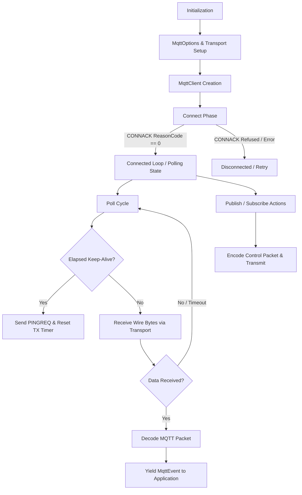
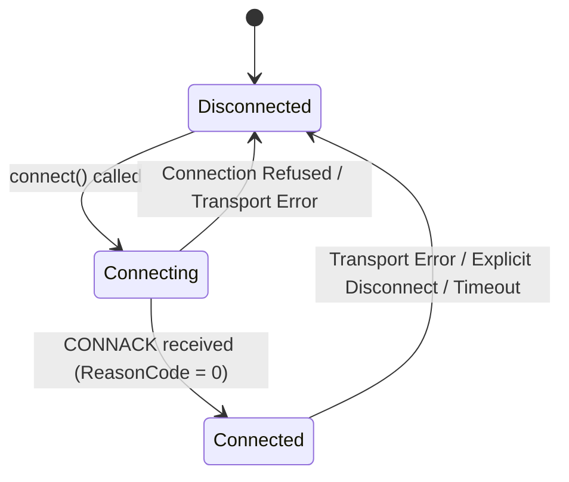

# Application Flow & Execution Lifecycle

This document describes the state machine, asynchronous control flow, packet exchange lifecycles, and polling loops for the `mqtt-async-embedded` library.

---

## 1. High-Level Architecture Flow

---

## 2. Client State Machine Transitions

The client inner state is managed by `ConnectionState` within `src/client.rs`:

### State Descriptions
1. **`Disconnected`**: The initial state. No socket or packet interactions occur. Any call to `poll()` or `publish()` returns `MqttError::NotConnected`.
2. **`Connecting`**: A `CONNECT` packet is encoded into the `tx_buffer` and sent via `T: MqttTransport`. The client await-reads a `CONNACK` response into `rx_buffer`.
3. **`Connected`**: MQTT connection established. `last_tx_time` is updated. Active polling and packet transmissions take place.

---

## 3. Core Operational Lifecycles

### 3.1. Connection Flow
1. **Configuration**: Construct `MqttOptions` with `client_id`, `broker_addr`, `broker_port`, and optionally `with_version()` or `with_keep_alive()`.
2. **Instantiation**: Instantiate `MqttClient::<T, MAX_TOPICS, BUF_SIZE>::new(transport, options)`.
3. **Handshake**:
   - `client.connect().await?`
   - Builds `Connect` packet with client identifier, clean session, and keep-alive duration.
   - Flushes packet onto the `MqttTransport` layer.
   - Waits for response and decodes into `MqttPacket::ConnAck`.
   - Transitions to `Connected` upon success (`reason_code == 0`).

### 3.2. Polling and Event Loop
The `poll()` method must be invoked in an async loop by the application task:
1. **Keep-Alive Check**: Compares `self.last_tx_time.elapsed()` against `keep_alive` duration. If expired, transmits `PINGREQ` and resets timer.
2. **Network Reception**: Calls `self.transport.recv(&mut self.rx_buffer).await`.
3. **Packet Processing**: If bytes are read, passes slice `&self.rx_buffer[..n]` to `packet::decode()`.
4. **Event Emission**: Yields zero-copy `MqttEvent<'p>` (e.g., `MqttEvent::Publish(Publish<'p>)`) bound to client buffer lifetime `'p`.

### 3.3. Publish Flow (Single & Multi-Packet Burst)
1. **Single Publish**: Application calls `client.publish(topic, payload, qos)`.
2. **Multi-Packet Burst**: Application passes slice `client.publish_batch(&[PublishMessage])`. Multiple packets are serialized into `tx_buffer` contiguously and transmitted in a single `send()` call.
3. If QoS > 0, the client automatically handles incoming `PUBACK` or sends `PUBACK` for received publishes during `poll()` / `poll_batch()`.

### 3.4. Multi-Packet Batch Polling Flow
1. Application calls `client.poll_batch::<MAX_EVENTS>()`.
2. Hardware reads up to `BUF_SIZE` bytes in a single `recv()`.
3. `RawPacketFrameIter` slices each complete packet frame without copying.
4. Returns a `heapless::Vec<MqttEvent<'p>, MAX_EVENTS>` for high-frequency burst processing.

### 3.5. MQTT over QUIC Real-Time Stream Flow
1. **Control Stream**: Bidirectional QUIC stream used for `CONNECT`, `CONNACK`, `PINGREQ`, `DISCONNECT`.
2. **Data Streams**: Independent unidirectional or bidirectional streams opened per topic group, completely bypassing Head-of-Line blocking.
3. **Datagram Channel**: `QuicMqttClient::publish_datagram` sends QoS 0 telemetry directly over unreliable QUIC datagrams with sub-millisecond dispatch.

