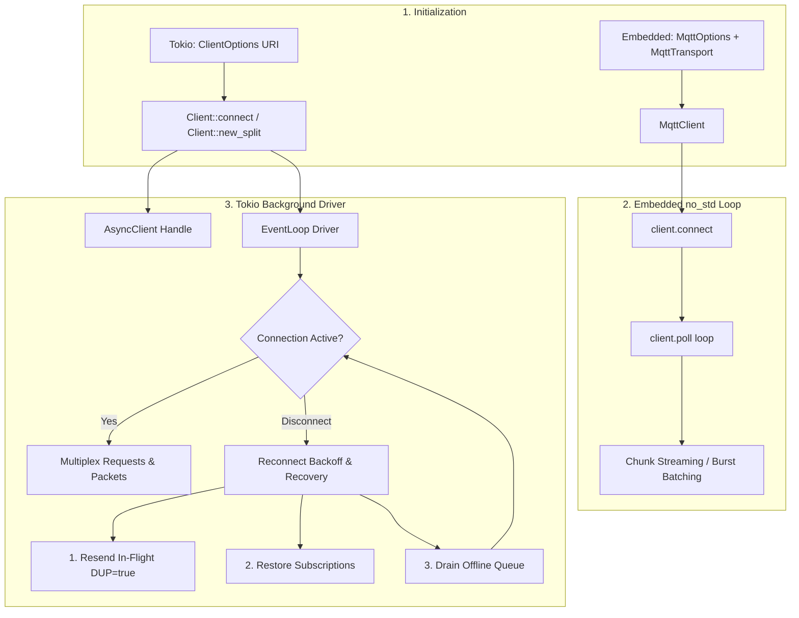
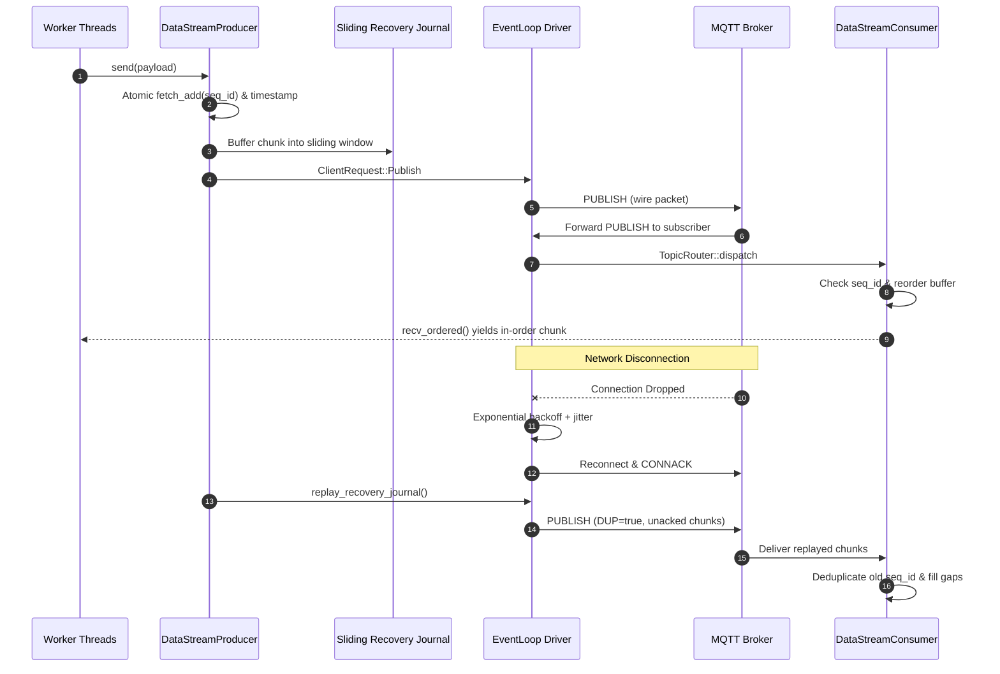

# Application Flow & Execution Lifecycle

State machines, packet lifecycles, and session recovery mechanics for `mqtt-async-embedded`.

---

## 1. Dual-Engine Architecture Flow

---

## 2. Multi-Threaded Data Stream & Recovery Pipeline

---

## 3. Operational Lifecycles

### 3.1. Reconnect & Recovery Sequence

1. **Disconnect Event**: Socket error or heartbeat timeout triggers `ConnectionStatus::Disconnected`.
2. **Backoff Calculation**: `ReconnectPolicy::compute_delay(attempt)` sets next retry interval (exponential + jitter).
3. **Transport Re-dial**: Reconnects over TCP, TLS, QUIC, Unix socket, or Windows Named Pipe.
4. **Resubscription**: Replays all active topics in `active_subscriptions` via batch `SUBSCRIBE`.
5. **In-Flight Retransmit**: Unacknowledged QoS 1 & 2 messages are marked `dup = true` and re-sent immediately.
6. **Offline Queue Flush**: Messages queued during outage are flushed based on `DropStrategy` (`DropOldest`, `ErrorOnFull`, `Block`).

---

### 3.2. Topic Stream Router

- **Structure**: Trie prefix tree matching exact paths, single-level (`+`), and multi-level (`#`) wildcards.
- **Lookup Time**: $O(k)$ where $k$ is topic path depth.
- **Zero-Copy Routing**: Distributes cloned `PublishMessage` handles (`bytes::Bytes`) to matching channels.
- **Auto-Pruning**: Automatically cleans up closed receiver channels to eliminate memory leaks.
