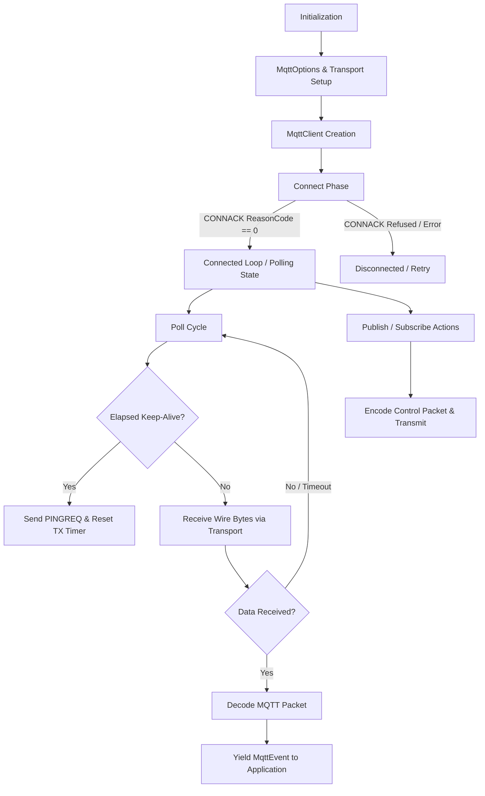

# Application Flow & Execution Lifecycle

This document describes the state machine, asynchronous control flow, packet exchange lifecycles, and polling loops for the `mqtt-async-embedded` library.

---

## 1. High-Level Architecture Flow



---

## 2. Client State Machine Transitions

The client inner state is managed by `ConnectionState` within `src/client.rs`:

```mermaid
stateDiagram-v8
    [*] --> Disconnected
    Disconnected --> Connecting: connect() called
    Connecting --> Connected: CONNACK received (ReasonCode = 0)
    Connecting --> Disconnected: Connection Refused / Transport Error
    Connected --> Disconnected: Transport Error / Explicit Disconnect / Timeout
```

### State Descriptions
1. **`Disconnected`**: The initial state. No socket or packet interactions occur. Any call to `poll()` or `publish()` returns `MqttError::NotConnected`.
2. **`Connecting`**: A `CONNECT` packet is encoded into the `tx_buffer` and sent via `T: MqttTransport`. The client await-reads a `CONNACK` response into `rx_buffer`.
3. **`Connected`**: MQTT connection established. `last_tx_time` is updated. Active polling and packet transmissions take place.

---

## 3. Core Operational Lifecycles

### 3.1. Connection Flow
1. **Configuration**: Construct `MqttOptions` with `client_id`, `broker_addr`, `broker_port`, and optionally `with_version()` or `with_keep_alive()`.
2. **Instantiation**: Instantiate `MqttClient::<T, MAX_TOPICS, BUF_SIZE>::new(transport, options)`.
3. **Handshake**:
   - `client.connect().await?`
   - Builds `Connect` packet with client identifier, clean session, and keep-alive duration.
   - Flushes packet onto the `MqttTransport` layer.
   - Waits for response and decodes into `MqttPacket::ConnAck`.
   - Transitions to `Connected` upon success (`reason_code == 0`).

### 3.2. Polling and Event Loop
The `poll()` method must be invoked in an async loop by the application task:
1. **Keep-Alive Check**: Compares `self.last_tx_time.elapsed()` against `keep_alive` duration. If expired, transmits `PINGREQ` and resets timer.
2. **Network Reception**: Calls `self.transport.recv(&mut self.rx_buffer).await`.
3. **Packet Processing**: If bytes are read, passes slice `&self.rx_buffer[..n]` to `packet::decode()`.
4. **Event Emission**: Yields zero-copy `MqttEvent<'p>` (e.g., `MqttEvent::Publish(Publish<'p>)`) bound to client buffer lifetime `'p`.

### 3.3. Publish Flow
1. Application calls `client.publish(topic, payload, qos)`.
2. Packet ID generation via wrapping counter `get_next_packet_id()`.
3. Packet is serialized into `tx_buffer` via `EncodePacket::encode`.
4. `MqttTransport::send` transmits the packet slice.
5. If QoS > 0, waits for corresponding `PUBACK` during polling cycles.
