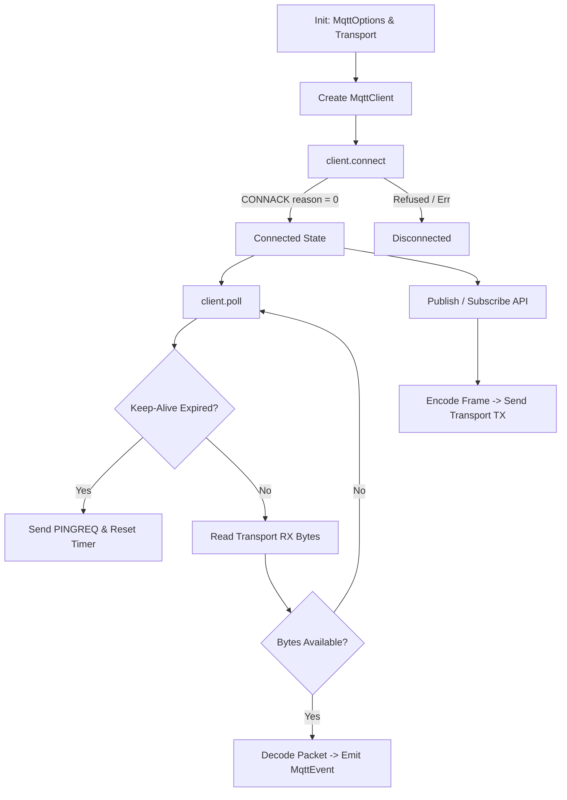
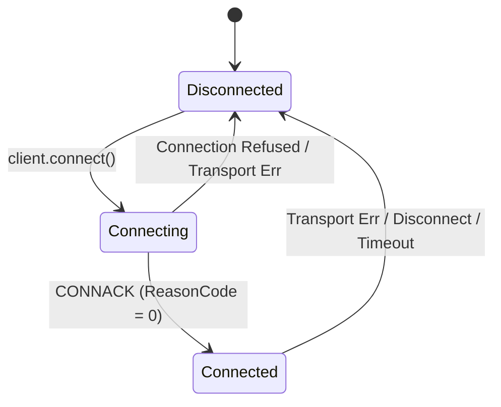

# Application Flow & Execution Lifecycle

State machine, asynchronous control flow, and packet exchange lifecycles for `mqtt-async-embedded`.

---

## 1. High-Level Architecture Flow

---

## 2. Client State Machine

Managed by `ConnectionState` in `src/client.rs`:

### States
- **`Disconnected`**: Idle. Calling `publish()` or `poll()` returns `MqttError::NotConnected`.
- **`Connecting`**: Serializes `CONNECT` into `tx_buffer`, sends via transport, awaits `CONNACK` into `rx_buffer`.
- **`Connected`**: Active connection. Updates `last_tx_time`. Ready for `poll()`, `publish()`, and `subscribe()`.

---

## 3. Core Operational Lifecycles

### 3.1. Connection Flow
1. Configure `MqttOptions` (broker IP/port, client ID, keep-alive, LWT).
2. Wrap socket with `EmbeddedIoTransport::new(socket)`.
3. Instantiate `MqttClient::<T, MAX_TOPICS, BUF_SIZE>::new(transport, options)`.
4. Run `client.connect().await` to exchange `CONNECT` and `CONNACK`.

### 3.2. Polling Loop (`client.poll()`)
Run inside an `async` loop:
1. **Heartbeat Check**: Sends `PINGREQ` if `last_tx_time.elapsed() >= keep_alive`.
2. **Read Hardware**: Calls `transport.recv(&mut rx_buffer)`.
3. **Decode Frame**: Parses received bytes slice without copying.
4. **Emit Event**: Returns `MqttEvent<'p>` (`Publish`, `PubAck`, `SubAck`, `UnsubAck`, `PingResp`, `Disconnect`).

### 3.3. Publish Operations
- **Single Publish (`client.publish`)**: Validates QoS (QoS 0 or 1), writes header + payload to `tx_buffer`, flushes to transport.
- **Burst Publish (`client.publish_batch`)**: Serializes multiple `PublishMessage` items into one network frame to cut socket syscall overhead.
- **QoS 1 Handling**: Inbound publishes auto-queue `PUBACK` during `poll()`. Outbound publishes await `PubAck`.

### 3.4. Subscribe & Unsubscribe
- **Subscribe (`client.subscribe`)**: Serializes `SUBSCRIBE` with topic filters + requested QoS, generates `packet_id`, awaits `SubAck`.
- **Unsubscribe (`client.unsubscribe`)**: Serializes `UNSUBSCRIBE` with topic filters, generates `packet_id`, awaits `UnsubAck`.

### 3.5. Batch Event Polling (`client.poll_batch`)
1. Reads up to `BUF_SIZE` bytes in one `recv()`.
2. `RawPacketFrameIter` slices every complete packet frame zero-copy.
3. Yields `heapless::Vec<MqttEvent<'p>, MAX_EVENTS>`.

### 3.6. QUIC Telemetry Flow
1. **Control Stream**: Bidirectional stream for `CONNECT`, `CONNACK`, `PINGREQ`, `DISCONNECT`.
2. **Dedicated Telemetry Streams**: `open_telemetry_stream()` isolates topic traffic, avoiding Head-of-Line blocking.
3. **Datagram Channel**: `publish_datagram()` sends QoS 0 telemetry over unreliable QUIC datagrams with sub-millisecond dispatch.

### 3.7. Zero-RAM Chunk Stream Publishing
1. Call `client.begin_stream_publish(topic, total_len, qos)`.
2. Encodes `PUBLISH` fixed header with full length and sends immediately.
3. Call `stream_writer.write_chunk(&chunk).await` repeatedly as DMA/ADC generates data.
4. Call `stream_writer.finish()` to assert `remaining_bytes == 0`.
