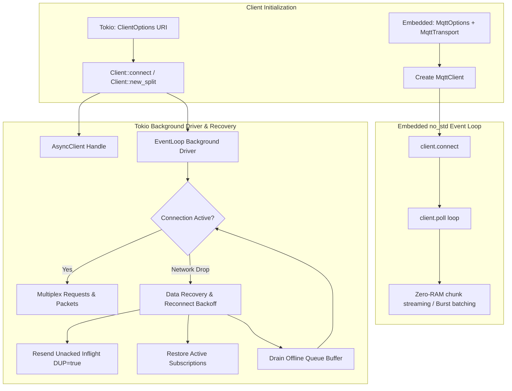
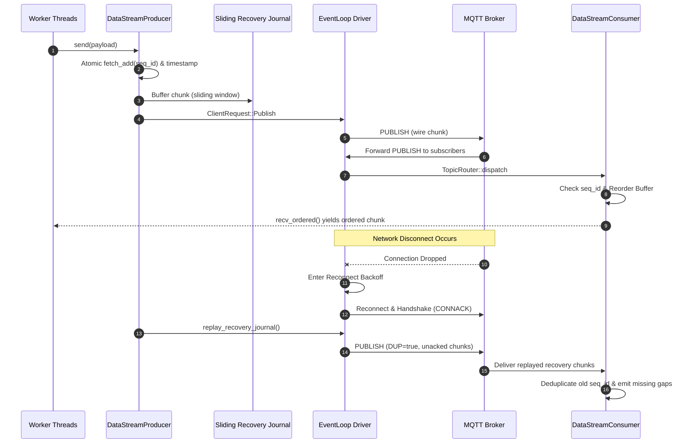

# Application Flow & Execution Lifecycle

State machine, asynchronous control flow, packet exchange lifecycles, and session data recovery flows for `mqtt-async-embedded`.

---

## 1. High-Level Dual-Engine Architecture Flow

---

## 2. Multi-Threaded Data Stream & Recovery Flow

---

## 3. Core Operational Lifecycles

### 3.1. Reconnection & Data Recovery Engine
1. **Detection**: Any I/O error or abrupt disconnect triggers `ConnectionStatus::Disconnected`.
2. **Backoff**: `ReconnectPolicy::compute_delay(attempt)` computes exponential backoff with jitter.
3. **Transport Reconnection**: Reconnects over configured target (TCP, TLS, QUIC, Unix socket, or Windows Named Pipe).
4. **Subscription Restoration**: All active subscriptions in `active_subscriptions` map are re-subscribed with broker `SUBSCRIBE` packets.
5. **In-Flight Retransmission**: Unacknowledged QoS 1 & 2 messages are re-encoded with `dup = true` and flushed to the network.
6. **Offline Queue Drain**: Messages buffered in the offline queue during the outage are drained according to `DropStrategy`.

### 3.2. Topic-Filtered Stream Routing
1. Calling `client.subscribe_stream("sensors/+/telemetry", qos)` registers an `mpsc::Sender<PublishMessage>` in the `TopicRouter` trie.
2. Inbound packets are matched against the trie nodes in $O(k)$ time where $k$ is the topic depth.
3. Matching streams receive zero-copy cloned `PublishMessage` handles.
4. If a subscriber drops its stream, the router detects closed channels and prunes dead nodes automatically.
