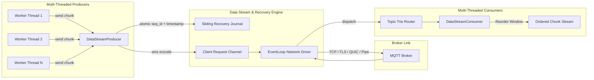

# Design Brief & Architectural Principles

Design philosophy, dual-mode execution model, and interface contracts of `mqtt-async-embedded`.

---

## 1. Core Principles

- **Dual-Mode Architecture**:
  - **Embedded Tier (`no_std`, `no_alloc`)**: Static compile-time buffers (`const BUF_SIZE: usize`) and `heapless` collections. No heap, no runtime fragmentation.
  - **Standard Tokio Tier (`tokio-client`)**: Multi-producer multi-consumer channels, zero-copy `bytes::Bytes`, multi-threaded data streams, and session data recovery.
- **Hardware & OS Decoupling**:
  - Embedded I/O goes through `MqttTransport` (TCP, UART modems, SPI) or `MqttQuicTransport`.
  - Host I/O goes through native OS transport drivers (Linux TCP/TLS/Unix, Windows Named Pipes, Android Abstract Namespace).
- **Native Async (Rust 2024)**: Non-blocking timers via `embassy-time` (bare metal) or `tokio::time` (host). Cancel-safe future mechanics throughout.
- **Session Data Recovery**:
  - Sliding recovery journal buffering recent sequence chunks.
  - In-flight message tracking with automatic retransmission (`DUP = true`).
  - Active subscription restoration across connection drops.
- **Topic-Filtered Stream Routing**:
  - Trie-based pattern matcher matching exact, single-level (`+`), and multi-level (`#`) wildcards.
  - Returns dedicated async `TopicSubscription` streams with automated dead-channel cleanup.

---

## 2. Multi-Threaded Data Stream Architecture

---

## 3. Hardware & Ecosystem Support Matrix

| Layer | Targets |
| :--- | :--- |
| **ESP32 MCUs** | ESP32-S series (S2, S3), ESP32-C series (C2, C3, C6, H2), ESP32 classic |
| **HALs** | `esp-hal` (`no_std`), `esp-wifi`, `esp-idf-svc`, `embassy-stm32`, `embassy-nrf`, `rp-hal` |
| **Runtimes** | `embassy-executor` (bare-metal), `tokio` (desktop/edge/mobile) |
| **Network Stacks** | `embassy-net` (`smoltcp`), `esp-wifi`, BSD sockets, UART AT modems |
| **Linux Drivers** | `tokio::net::TcpStream`, `tokio-rustls`, `quinn` (QUIC), `tokio::net::UnixStream` |
| **Windows Drivers** | TCP, TLS, QUIC, **Windows Named Pipes** (`pipe://\\.\pipe\mqtt_ipc`) |
| **Android Drivers** | TCP, TLS, QUIC, **Android Abstract Sockets** (`unix://@android_mqtt_ipc`) |
