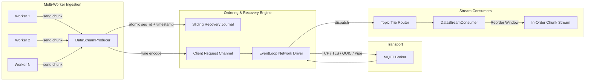

# Design Brief & Architectural Principles

Design philosophy, dual-mode execution model, and hardware/OS targets for `mqtt-async-embedded`.

---

## 1. Core Principles

- **Dual-Mode Execution**:
  - **Embedded Tier (`no_std`, `no_alloc`)**: Static compile-time buffers (`const BUF_SIZE: usize`), zero heap allocation, `heapless` collections. Zero runtime fragmentation.
  - **Standard Tokio Tier (`tokio-client`)**: Multi-producer channels, `bytes::Bytes` zero-copy payload handles, multi-threaded data streams, and session data recovery.
- **Hardware & OS Decoupling**:
  - Embedded I/O connects via `MqttTransport` (TCP, UART, SPI) or `MqttQuicTransport`.
  - Host I/O connects via native OS drivers (Linux TCP/TLS/Unix, Windows Named Pipes, Android Abstract Namespace).
- **Native Async (Rust 2024)**: Non-blocking timers via `embassy-time` (bare metal) or `tokio::time` (host). Cancel-safe state machines throughout.
- **Session Data Recovery**:
  - Sliding recovery journal buffering recent sequence chunks.
  - In-flight message tracking with automatic retransmission (`DUP = true`).
  - Active subscription restoration across connection drops.
- **Topic-Filtered Stream Routing**:
  - Prefix trie matching exact paths, single-level (`+`), and multi-level (`#`) wildcards.
  - Generates dedicated async `TopicSubscription` streams with automated dead-channel pruning.

---

## 2. Multi-Threaded Data Stream Pipeline

---

## 3. Platform & Target Matrix

| Layer | Supported Targets |
| :--- | :--- |
| **Microcontrollers** | ESP32 (Classic, S2, S3, C2, C3, C6, H2), ARM Cortex-M (M0/M3/M4/M7/M33), RISC-V |
| **Hardware HALs** | `esp-hal` (`no_std`), `esp-wifi`, `esp-idf-svc`, `embassy-stm32`, `embassy-nrf`, `rp-hal` |
| **Async Runtimes** | `embassy-executor` (bare metal), `tokio` (Linux, Windows, macOS, Android) |
| **Network Stacks** | `embassy-net` (`smoltcp`), `esp-wifi`, BSD sockets, UART AT modems |
| **Linux Drivers** | TCP (`TCP_NODELAY`), TLS (`tokio-rustls`), QUIC (`quinn`), Unix Domain Sockets |
| **Windows Drivers** | TCP, TLS, QUIC, **Windows Named Pipes** (`pipe://\\.\pipe\mqtt_ipc`) |
| **Android Drivers** | TCP, TLS, QUIC, **Android Abstract Sockets** (`unix://@android_mqtt_ipc`) |
| **Web Server Bridges** | **Axum**, **Actix-web**, Server-Sent Events (SSE), Multipart MJPEG Camera Streams |

